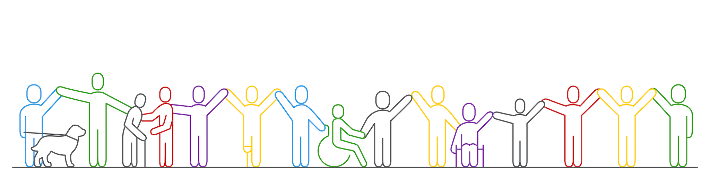

[Apply](application.md) to our free 2026 PAS4AI Workforce program!

## AI Course and Summer Internship 2026

Are you an autistic student in community college in the USA? Are you interested in exploring a career in artificial intelligence (AI)? 

In our Spring 2026 online course, you will be taught the fundamentals of AI, data science, and machine learning. Those who succesfully complete the course will be matched with a summer internship at a professional organization. 

Applications for the Summer 2026 program are due January 31, 2026. 

## Preparing Autistic Students for the AI Workforce

The USA faces a shortage of talent in the emerging technology field of artificial intelligence (AI). 
    We can ameliorate the shortage by reaching out to untapped populations, such as autistic STEM community 
    college students. Autistic people often demonstrate a strong affinity for STEM; however, they suffer 
    from an 80% unemployment rate due to social stigma and discrimination. 
    
The goal of our project is to address the employment gap by establishing innovative pathways for
    autistic students to specialize in AI careers. This proposal will develop innovative pedagogical 
    materials and scalable tools to teach AI technical skills through a "learning-by-doing" experience, 
    teach crucial team collaboration and communication skills through AI-focused project-based learning, 
    and facilitate autistic community college students to obtain AI-focused summer internships and 
    increase their access to AI careers. By providing internships for autistic students, this project 
    will debunk the harmful stereotypes and change the exclusionary norms that impact their employment.
 
We use a strengths-based approach to provide strategies and supports that allow individuals with 
    autism to engage confidently, competently, and with a positive sense of self when navigating 
    the complex and challenging social environment of the workplace. Our pedagogical innovations 
    include the human factors and user interface design to support AI subject-matter experts, mentors, 
    and teachers learning to teach autistic students. Special education experts in autism who 
    specialize in teaching communication, social, and teaming skills support our mentors 
    in their day-to-day learning experiences. We employ online training to reach more autistic 
    students and also make our online course materials available to community college teachers 
    to offer this course at their own schools. Our program is scalable and self-sustaining 
    through the training of mentors to support autistic people and have those mentors work with 
    the interns in our program.

## People
  
### Principal Investigators




    

        
        

            <h3 class="pi-name">
                
                    <a href="{{pi.website}}" target="_blank">
                        {{pi.name}}
                    </a>
                
                    {{pi.name}}
                
            </h3>
            

                {{pi.bio}}
            
 
            
                
{{pi.affiliation}}

		    
        

    



### Senior Personnel




    

        
        

            <h3 class="pi-name">
                
                    <a href="{{pi.website}}" target="_blank">
                        {{pi.name}}
                    </a>
                
                    {{pi.name}}
                
            </h3>
            

                {{pi.bio}}
            

            
                
{{pi.affiliation}}

		    
        

    



### External Evaluator




    

        
        

            <h3 class="pi-name">
                
                    <a href="{{pi.website}}" target="_blank">
                        {{pi.name}}
                    </a>
                
                    {{pi.name}}
                
            </h3>
            

                {{pi.bio}}
            

            
                
{{pi.affiliation}}

		    
        

    



